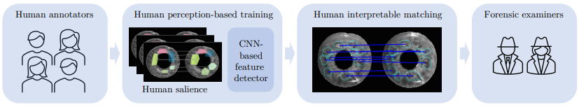
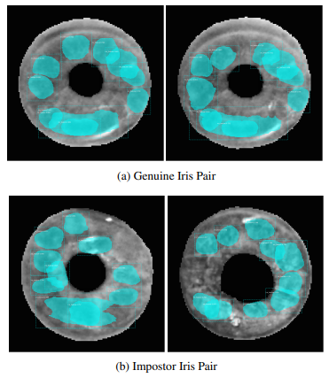
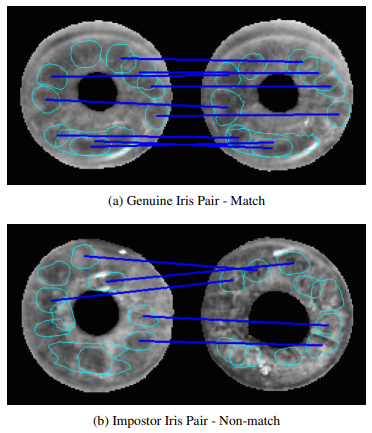
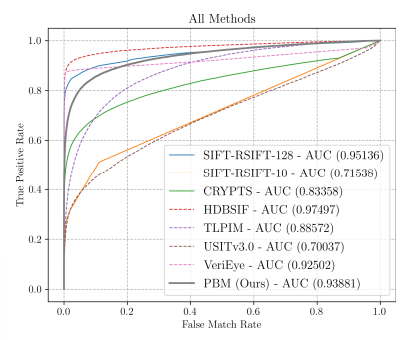

# Human Saliency-Driven Patch-based Matching for Interpretable Post-mortem Iris Recognition

<p align="center">
Aidan Boyd, Daniel Moreira, Andrey Kuehlkamp, Kevin Bowyer, Adam Czajka <br>
University of Notre Dame, Notre Dame IN 46556, USA <br>
{aboyd3,dhenriq1,akuehlka,kwb,aczajka}@nd.edu <br>
<a href="https://arxiv.org/abs/2208.03138">Official Paper</a> <br> <br>

</p>

## Abstract
<p>
Forensic iris recognition, as opposed to live iris recognition, is an emerging research area that leverages the discriminative power of iris biometrics to aid human examiners in their efforts to identify deceased persons. As a machine learning-based technique in a predominantly humancontrolled task, forensic recognition serves as “back-up” to human expertise in the task of post-mortem identification. As such, the machine learning model must be (a) interpretable, and (b) post-mortem-specific, to account for changes in decaying eye tissue. In this work, we propose a method that satisfies both requirements, and that approaches the creation of a post-mortem-specific feature extractor in a novel way employing human perception. We first train a deep learning-based feature detector on postmortem iris images, using annotations of image regions highlighted by humans as salient for their decision making. In effect, the method learns interpretable features directly from humans, rather than purely data-driven features. Second, regional iris codes (again, with human-driven filtering kernels) are used to pair detected iris patches, which are translated into pairwise, patch-based comparison scores. In this way, our method presents human examiners with human-understandable visual cues in order to justify the identification decision and corresponding confidence score. When tested on a dataset of post-mortem iris images collected from 259 deceased subjects, the proposed method places among the three best iris matchers, demonstrating better results than the commercial (non-humaninterpretable) VeriEye approach. We propose a unique post-mortem iris recognition method trained with human saliency to give fully-interpretable comparison outcomes for use in the context of forensic examination, achieving state-of-the-art recognition performance.
</p>

## Data Used
The first publicly-available dataset for post-mortem iris recognition is the Warsaw BioBase Postmortem Iris v2.0 (Warsaw v2.0). It consists of 1,200 near-infrared (NIR) post-mortem images from 37 unique cadavers in a mortuary environment. The PMI ranges from 5 to 800 hours. Two additional datasets were used in this work, both acquired in an operational medical examiner’s setting. The first of these, dataset 1, contains 621 NIR images from 134 cadavers (254 distinct irises). Images were acquired in sessions of varying PMI, up to a maximum of 9 sessions and 284 hours after death. The second dataset, dataset 2, consists of 5, 770 NIR images from 259 subjects. The longest PMI in this dataset is 1,674 hours (69 days), captured at 53 different PMI sessions. Warsaw v2.0, dataset 1 and dataset 2 are entirely subject-disjoint. Also, while dataset 1 and dataset 2 were collected at the same institution, Warsaw v2.0 was collected at a different institution. Warsaw v2.0 is combined with dataset 1 to create what is referred to as the “combined dataset” used for training and validation, and to collect human decisions and annotations, as described in Sec. 3. Dataset 2 is held out during training and validation and acts as a subject-disjoint test set.

## Methodology
<p align=center>
  
  &nbsp;&nbsp;&nbsp;&nbsp;&nbsp;&nbsp;&nbsp;
  
</p>
<p>
A MaskRCNN instance segmentation architecture with a ResNet50 backbone is trained to detect individual features present in the iris. In addition, a confidence score is also returned and can be used to rank the detected features. Two examples of iris images with detected features can be seen in the left figure above.
</p>
<p>
After detecting these features, pairs of features that are matched as being the most similar are linked (as shown by the dark blue lines in the right figure above). The genuine pair (a) shows parallel lines linking features resulting in a match, whereas the impostor pair (b) has crossing lines and a non-match result. The human examiner can quickly verify the algorithm’s result by examining the proposed matching features.
</p>

## Results Summary

<p>
From the ROC curves to the right, the best performing method on the held-out testing set (dataset 2) is HDBSIF. This is consistent with the results for post-mortem iris recognition. However, HDBSIF is not human-interpretable, as it gives no indication of what features were important in the matching.
</p>
<p>
The best performing method that supplies justification of the decision is SIFT-RSIFT-128. However, because SIFT-RSIFT-128 uses 128 keypoints on each iris, the matching visualization may become cluttered and the interpretability is reduced due to the large number of extracted regions. Moreover, as in typical SIFT-like approaches, keypoints are represented by their central locations and compulsorily regular neighborhoods (usually circular or rectangular, thus ignoring the shapes of the compared regions during matching), making them not anatomy-driven and less human-interpretable. When the number of keypoints in the SIFT-RSIFT approach is reduced to be the same as for PBM, and thus its results are less cluttered, the performance decreases significantly to an AUC of 0.715 (see SIFT-RSIFT-10). Lastly, SIFT-RSIFT keypoints are not iris inspired and thus may not appear salient to a human examiner.
</p>
<p>
In our proposed PBM method, the feature extractor is trained from human-annotated iris patches used in matching. In addition to generating more human-understandable features, this apparently brings a set of very discriminative features. Surprisingly, the PBM approach outperforms deep learning-based method (TLPIM), commercial (VeriEye) and Daugman-like approaches (USITv3.0), while also displaying interpretablity.
</p>

## Usage

This is the command line interface for the patch-based matching of two iris images.
All code was written to run on a GPU, but in the case none is available it should run fine on a CPU.

### Download the trained model

The model can be downloaded here: (Box Drive)[https://notredame.box.com/s/vohyjgdrzs2t03jo2cq5db3j999www51] | (Google Drive)[https://drive.google.com/file/d/1w5nEesvF--j9nYslPOHnDKTwcIk4WqS1/view?usp=sharing]

Place the model (named wacv_model.h5) in a folder named ./Model/ such that the final path is ./Model/wacv_model.h5 

### Creating the environment:

To create the conda environment to run this code, run the following commands:
````
conda env create -f environment.yml
* OR *
conda create --name pbm --file requirements.txt
conda activate pbm
````
This operates on a linux machine, and has not been tested on Apple chips.

### Preparing the data

Currently there is an assumption that the images have been previously segmented and cropped to images of size 256x256px. Segmentation masks must also be cropped to the same as the images. Images and masks must have the same filenames and be placed in distinct folders i.e. ./workdir/input/images/ and ./workdir/input/masks/

Examples of a segmented and cropped image and mask:


For matching, a file must be created to determine which images are going to be matched, this must follow the same format as in the example, the text file ./example_pairs.txt

### Running the code

To run the program, you need to specify the path to the matching pairs file, the location of the images, the location of the masks, and where to save the output scorefile. Example:

````
python pipeline_from_file.py --textfile ./example_pairs.txt --cropped_image_path ./workdir/input/images/ --cropped_mask_path ./workdir/input/masks/ --scorefile ./example_scores.txt
````

The pipeline_from_file.py file should run with default parameters, but we suggest that users modify them to their own specifications. You should not need to change the model path, please use wacv_model.h5.

By default, the output visualizations are saved in ./workdir/patch-based/output/ but this can be modified using the --destination flag.

### Output scores

The scorefile generated will contain four columns; the probe image, the gallery image, whether it is genuine or not (0 for different eyes and 1 for a genuine pair) and the distance measure which can be used for plotting.

## Citation

If you used this code in your work, please cite:
````
@article{boyd2022human,
  title={Human Saliency-Driven Patch-based Matching for Interpretable Post-mortem Iris Recognition},
  author={Boyd, Aidan and Moreira, Daniel and Kuehlkamp, Andrey and Bowyer, Kevin and Czajka, Adam},
  journal={arXiv preprint arXiv:2208.03138},
  year={2022}
}
````
